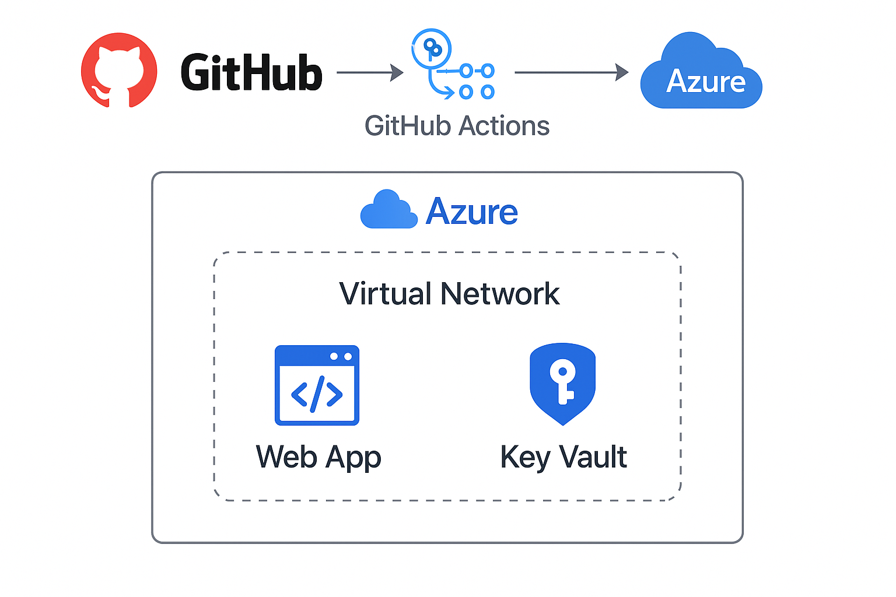

# Azure AutoDeploy 🚀

Modular infrastructure deployment for Azure using **Bicep** and **GitHub Actions**. Easily spin up environments with Virtual Network, Azure Web App, and Key Vault components.

---

## 📐 Architecture



---

## ✨ Features

- ⚙️ Modular Bicep templates
- 📦 GitHub Actions CI/CD
- 🌐 Virtual Network
- 🕸️ Web App (App Service)
- 🔐 Azure Key Vault
- 📁 Environment-specific parameter files (dev/test/prod)

---

## 🚀 Quickstart

1. **Fork or clone** this repo
2. Create a resource group:
   ```bash
   az group create --name rg-autodeploy --location westeurope
   ```
3. Create a service principal and set GitHub Secrets:
   ```bash
   az ad sp create-for-rbac --sdk-auth > creds.json
   ```
   Add to GitHub Secrets:
   - `AZURE_CREDENTIALS`: contents of `creds.json`
   - `AZURE_SUBSCRIPTION_ID`: your subscription ID

4. **Push to `main` branch** → GitHub Actions auto-deploys infra to Azure

5. **OR deploy locally**:
   ```powershell
   ./scripts/validate-deploy.ps1 -Environment dev
   ```

---

## 🧪 Environments
- `bicep/parameters/dev.json`
- `bicep/parameters/test.json`
- `bicep/parameters/prod.json`

Modify these files to suit your environment needs.

---

## 🛠️ Coming Soon
- Application Insights integration
- Multi-environment GitHub Actions matrix
- Cost estimation + linting with `bicep lint` and `what-if`

---

## 🤝 Contributing
Contributions welcome! Fork the repo, create a branch, and submit a PR.

---

## 📄 License
MIT

---
